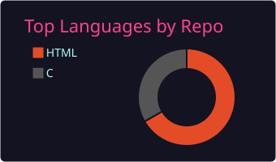
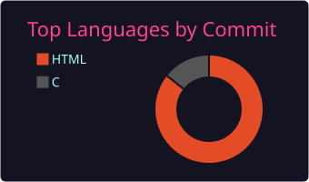
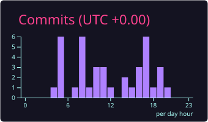

  <h1>👋 Hi, I'm Jiya Shah</h1>
  <h3>🌱 Beginner in Programming &nbsp;|&nbsp; 💻 Learning & Exploring &nbsp;|&nbsp; 🚀 Building Cool Projects</h3>

   

  <!-- Quick Badges -->
  
  
  
  

 

---

## 💫 About Me

<table align="center" width="100%">
  <tr>
    <td width="50%" valign="top">
      <h3>🚀 Quick Intro</h3>
      <ul>
        <li>🌱 <b>Current Focus:</b> Learning & Exploring core programming concepts.</li>
        <li>💻 <b>Passionate About:</b> Web development, problem-solving & building cool tools.</li>
        <li>🎓 <b>Journey:</b> Expanding my knowledge every single day!</li>
      </ul>
    </td>
    <td width="50%" valign="top">
      <h3>⚡ Quick Links & Info</h3>
      <ul>
        <li>📁 <b>Repositories:</b> <a href="https://github.com/JIYA-R5?tab=repositories">View All Repositories</a></li>
        <li>🤝 <b>Open To:</b> Collaborating on beginner & open-source projects.</li>
        <li>💬 <b>Ask Me About:</b> HTML, CSS, JavaScript & Python basics.</li>
      </ul>
    </td>
  </tr>
</table>

---

## 🛠️ Tech Stack & Tools

### 💻 Languages & Frontend

 

### ⚙️ Tools & Environment

---

## 📊 GitHub Analytics & Repository Stats
<i>⚡ Auto-updated every 30 minutes. Click any card to explore all repositories!</i>

<table align="center" border="0" width="100%">
  <tr>
    <td align="center" width="50%">
      
    </td>
    <td align="center" width="50%">
      
    </td>
  </tr>
  <tr>
    <td align="center" colspan="2" width="100%">
      
    </td>
  </tr>
</table>

---

## 🐍 Contribution Snake Eater
<i>🎮 Interactive contribution grid animation (updates every 30 minutes). Click grid to view all repositories!</i>

  

---

## 📈 Contribution Activity Graph

  

---

## 🏆 GitHub Achievements & Trophies

  

 

---

  

